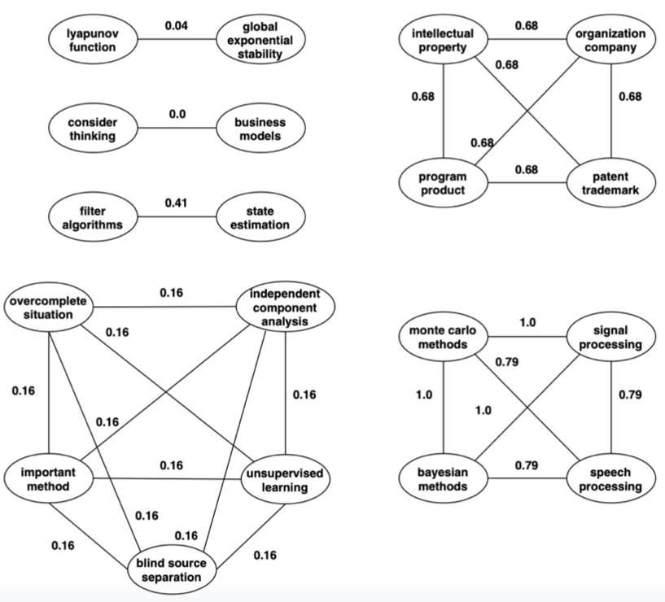
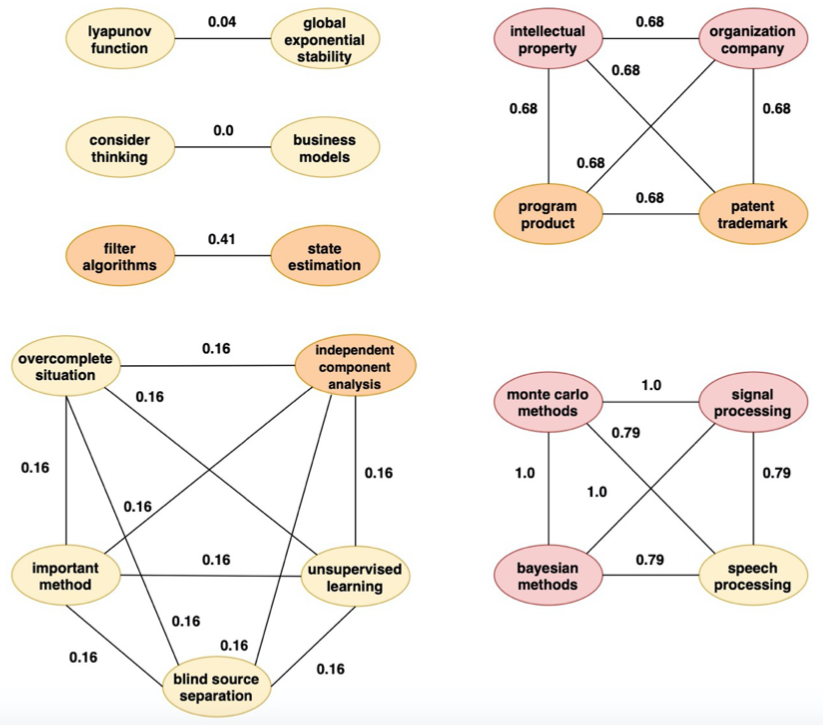

# Mining Evolving Topics

Project for [Web and Social Information Extraction](https://twiki.di.uniroma1.it/twiki/view/Estrinfo) course (A.Y. 2018/2019), full details are available in the [report](./reportWSIE.pdf).

## Introduction
This project aimed to identify and trace topics over a temporal interval, where a topic is a set of keywords. Hence, one can see changes in the keyword set of topics throughout the specified time. 

## Tasks

## 1. Top-k keywords
**Select top-k keywords** for each year, where k is the number of generated topics (k=5,10,20,100), according to a certain metric.

Working in a "step-by-step" waym using an iterator over the years, at every step, I generated two graphs:
1. The first graph is the one that contains all the keywords that are in the ds1. I called this graph current_key_graph, and it is composed as follows: for each row of the dataset, I added two nodes that are the two keywords and an edge between these two nodes. Edges are weighted, and after several tries (see the code), I decided to set weights using a _custom metric_ I defined.
2. The second graph is the one that contains all the authors that are in the ds2. I called this graph current_aut_graph, and it is composed as follows: for each row of the dataset, I added two nodes that are the two authors and an edge between these two nodes that represent the co-authorships. Edges are weighted with the number of co-citations between the two authors. I used this graph only to create the weights_dict. 

For example the 2002 graph has the following structure:

Since, for each year, the keywords graph was a graph not totally connected, but it had several connected components, I chose to use the **Pagerank** algorithm to find the top-k keywords.

After the Pagerank execution on the 2002 graph the result is the following:

Where:
* **Red**: top-**5** keywords identified
* **Red** and **Orange**: top-**10** keywords identified
* **Red**, **Orange** and **Yellow**: means top-**20** (and top-**100**) keywords identified (Since the number of nodes of this graph is 19, the top-100 keywords and top-20 keywords are the same, the entire graph).

Even if I thought that the best choice was to use the Pagerank, I tried to apply other two metrics to see what happens: 
* _Degree Centrality_: the degree centrality for a node v is the fraction of nodes it is connected to. 
* _Betweenness Centrality_: counts the number of geodesic paths between i and k that actor j resides on; geodesics are defined as the shortest path between points[2]. 

These two metrics didn’t produce good results because the keyword graph is not fully connected, so the effect depended only on where the algorithm started, from which component. 

## 2. Spreading of Influence
The second task was to **apply a Spreading of Influence algorithm** to report nodes influenced in each algorithm iteration. The influenced nodes represent a topic. The algorithm uses the top-k as seeds, starting from the top-5 nodes until the top-100.

There are two basic classes of diffusion modelsThere are two basic classes of diffusion models: _threshold_ and _cascade_. The network is represented as a directed graph, and in our case, each keyword represents a node. Nodes start either active or inactive; an active node may trigger activation of neighboring nodes. : threshold and cascade. The network is represented as a directed graph and in our case each keyword represents a node. Nodes start either active or inactive, an active node may trigger activation of neighboring nodes.

Since all the algorithms use a directed graph and since I had to decide the threshold function, I created a new graph called current_spread_graph which is a directed graph where weights on edges are values between 0 and 1 chosen in the following way:

<i>The ’old’ weight of the edge is multiplied by the degree of the node (where the degree of the node, since the graph is weighted, is the sum of the weight). Then the result is normalized since the threshold is a value between [0,1].</i>

So the main reason why I applied the Idependent Cascade model is that it applies threshold on edges while other models, like the Linear Threshold, apply threshold on nodes.

For example, lets analyze the 2013:
File: output_file\ranking\pagerank.csv, **top-5 keywords** are:
* _simulation_, pagerank score: 0.01997660905332627
* _algorithm_, pagerank score: 0.019891039782059163
* _mathematical optimization_, pagerank score: 0.019749834725123067
* _sampling signal processing_, pagerank score: 0.019053858071798553
* _artificial neural network_, pagerank score: 0.01904089663953379

File: output_file\identification\topics.json, top-5 topics are:
* **T1**: simulation, telecommunications link
* **T2**: algorithm, simulation, sampling signal processing, lyapunov fractal, nonlinear system, dynamic programming, artificial neural network, sampling surgical action, throughput, word embedding, social inequality, recurrent neural network
* **T3**: algorithm, mathematical optimization, sampling signal processing, sampling surgical action, data synchronization, linear matrix inequality, optimization problem, artificial neural net- work, neural network simulation
* **T4**: algorithm, sampling signal processing, data synchronization
* **T5**: lyapunov fractal, artificial neural network, sampling signal processing, algorithm, simultion, numerical analysis, social inequality, neural networks, qlearning,machine learning For example we can notice that the keyword ’algorithm’ occurs in 3 topic.

We can notice that the keyword _algorithm_ occurs in 3 topics.

## 3. Merge

The third task was to **join the produced topics** in a given year following a merging strategy which takes care of possible overlaps among them.

Since my idea was to run one seed at a time, I had k set of keywords representing the k topic of a specific year at the end of the Independent Cascades execution. As I previously said and showed, these sets can have common keywords. My idea for merging was to use the **cosine similarity** that measures the similarity between two vectors of an inner product space. It is measured by the cosine of the angle between two vectors and determines whether two vectors are pointing in roughly the same direction. It is often used to measure document similarity in text analysis. 

For every possible couples of topic in the top-k if the cosine similarity is equal or greater than 0.5 then I merge the two topics, otherwise nothing. For example if we analyze the previous example, one possible case of 2013:
* **T2**: algorithm, artificial neural network, dynamic programming, lyapunov fractal, nonlinear system, recurrent neural network, sampling signal processing, sampling surgical action, sim- ulation, social inequality, throughput, word embedding
* **T5**: algorithm, artificial neural network, lyapunov fractal, machine learning, neural networks, numerical analysis, sampling signal processing, simulation, social inequality, qlearning
**Common keywords**: algorithm, artificial neural network, lyapunov fractal, sampling signal process- ing, simulation, social inequality

So these two topics can be merged in order to obtain the new topic:
* **T2,5**: algorithm, artificial neural network, dynamic programming, lyapunov fractal, machine learning, neural networks, nonlinear system, numerical analysis, qlearning, recurrent neural network, sampling surgical action, sampling signal processing, simulation, social inequality, throughput, word embedding

All the merged topics are inserted in a new dictionary that is saved in the output_file\identification directory that has the same structure of the previous dictionary; for each key are present all the topics, the ones identified in the first step and the one that are the result of the merge of two topics.

## 4. Trace

The last task was **tracing** over the timeline [2000-2018] any topic identified in the previous task, analyzing the temporal/structural behavior, and deciding if topics identified in consecutive years can be merged. Then create a final list of the merged topics.

For example, starting from the topic

<i>[’artificial neural network’, ’neural network simulation’, ’recurrent neural network’, ’sampling surgical action’, ’sampling signal processing’, ’synchronization computer science’]</i>

I got the new topic

<i>[’linear matrix inequality’, ’simulation’, ’lyapunov fractal’, ’vertex’, ’neural network simulation’, ’artificial neural network’, ’sampling surgical action’, ’sampling signal processing’, ’experiment’, ’data synchronization’, ’synchronization computer science’, ’recurrent neural network’]</i>

_In some cases is only a **small evolution**, but in any case it’s an **evolution**!